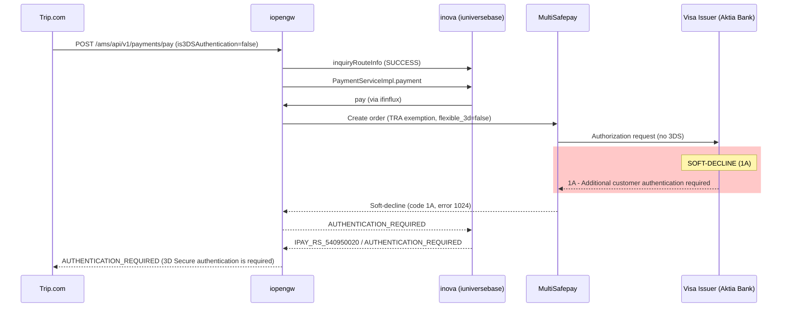

## Issue Summary
- **Trace ID**: 21b1c25c17768466667358774e2ca3
- **Error Time**: 2026-04-22 08:31:08 (UTC)
- **Primary Application**: inova (iuniversebase)
- **Downstream System(s)**: iopengw → MultiSafepay (acquiring channel)
- **Symptom**: Payment returned `AUTHENTICATION_REQUIRED` (IPAY_RS_540950020) — card payment was soft-declined by the issuer with response code `1A` ("Additional customer authentication required")
- **Expected Behavior**: Payment should complete successfully (or with 3DS authentication if required)
- **Error Origin**: Visa card issuer (via MultiSafepay) — soft-declined the TRA exemption request

### Error Classification
- **Classification**: Business Error
- **Sub-classification**: Consistent Error
- **Reasoning**: The issuer soft-declined the Transaction Risk Analysis (TRA) exemption. Under PSD2/SCA regulations in the EEA, the card issuer can require 3DS authentication. The merchant (Trip.com) sent the payment with `is3DSAuthentication: false` and `enableAuthenticationUpgrade: false`, preventing automatic 3DS retry. This will consistently occur for this card/transaction type until 3DS is enabled.
- **Fix Responsibility**: Merchant (Trip.com) — needs to enable 3DS authentication or authentication upgrade

## Log Evidence

### Service Call Chain (from Yuntu Trace Tree)
```
iopengw [INBOUND_REQUEST] (from merchant)
  → igacqrouter.doContainerDecision
    → iuniversebase.inquiryRouteInfo (route inquiry - SUCCESS)
  → iopengw [OUTBOUND_REQUEST] (to iexpprod)
    → iexpprod.convert
    → iuniversebase.handle (PaymentServiceImpl.payment)
      → icardcenter.registerCardUseLog
      → isecurityguard.decide (security decision)
      → iuniversebase.batchApplyTradeOrder
      → ifinflux.payRoute
      → ipayment.pay → ifinflux.pay
    → iopengw [OUTBOUND_REQUEST] (to MultiSafepay)
      → MultiSafepay CREDITCARD gateway
    → iopengw [INBOUND_RESPONSE] (AUTHENTICATION_REQUIRED)
```

### Service Call Sequence Diagram


### Primary System Logs (inova / iuniversebase)

**Biz Service Digest** — Payment result:
```
2026-04-22 08:31:08,645 INFO INOVA-BIZ-SERVICE-DIGEST-LOGGER
(SynResult) (0,0)(PaymentServiceImpl,payment,false,IPAY_RS_540950020,AUTHENTICATION_REQUIRED,ResultStatusType{description='FAIL'},false,1665ms)
(alipay.ams.payments.pay,1.0,2190170133207705,-,SAANTOM20260422163106626214053989)
(CASHIER_PAYMENT,CARD)(5YEY7Y304RQQ01401,2190170133207705,SAANTOM20260422163106626214053989,CASHIER_PAYMENT,KA)
(20260422264010800100190620231196704,SAANTOM20260422163106626214053989,false,GLOBAL,VISA,FI,479805,null)
```

**Integration Digest** — Result info mapping:
```
2026-04-22 08:31:08,645 INFO INOVA-INTEGRATION-DIGEST-LOGGER
(0,0)(ResultInfoCommonService_matchCustomResultInfo,alipay.ams.payments.pay-2190170133207705-IPAY_RS_540950020,true,-,2ms,iexpcontrol,...)
```

**Integration Digest** — Payment flow calls (all succeeded at RPC level):
```
paramQueryClient.querySignProductByMerchantId → IPAY_RS_100000200 (SUCCESS)
cardInfoQueryService.queryCardDetailInfo → IPAY_RS_100000200 (SUCCESS)
richClientPaymentMethodQueryService.queryPaymentMethodList → IPAY_RS_100000200 (SUCCESS)
TradeServiceClient.batchApplyTradeOrder → 51ms (SUCCESS)
richClientPaymentMethodDecideService.decidePayment → IPAY_RS_100000200 (SUCCESS)
richClientChannelRouteService.route → IPAY_RS_100000200 (SUCCESS)
paymentSecurityServiceWrapper.decide → 9ms (SUCCESS)
paymentService.pay → 50ms (ipaymentcore, RPC SUCCESS)
```

### Downstream System Logs (iopengw)

**INBOUND_REQUEST** (from Trip.com):
- API: `alipay.ams.payments.pay`
- Merchant: `2190170133207705` (Trip.com), clientId: `5YEY7Y304RQQ01401`
- Payment: EUR 234.47 (order: Xiamen-Wuhan flight)
- Card: VISA credit card, bin 479805, issuing country: FI (Finland)
- `is3DSAuthentication: false` — merchant did NOT request 3DS
- `isCardOnFile: true` — card-on-file payment
- `enableAuthenticationUpgrade: false` — merchant did NOT allow auth upgrade
- Network token: `4798059821118605` with cryptogram

**OUTBOUND_REQUEST** (to MultiSafepay):
- Gateway: CREDITCARD
- `sca_exemption: transaction_risk_assessment` — TRA exemption requested
- `flexible_3d: false` — 3DS not enabled
- `card_holder_name: Mikko Veijalainen`
- Type: direct, recurring model: cardOnFile

**OUTBOUND_RESPONSE** (from MultiSafepay — SOFT-DECLINE):
```json
{
  "success": false,
  "data": {
    "payment_details": {
      "code": "4004",
      "response_code": "1A",
      "reason": "Soft-decline",
      "card_authentication_result": {
        "chargeback_liability": "MERCHANT"
      },
      "card_authentication_details": {
        "exemption": "transaction_risk_analysis",
        "threeds_exemption": false,
        "flow": "exemption"
      },
      "card_additional_response_data": {
        "merchant_advice_code": "3",
        "sca_details": {
          "tra_exemption_indicator": "2"
        },
        "cavv_results_code": "2"
      }
    }
  },
  "error_code": 1024,
  "error_info": "declined"
}
```

**INBOUND_RESPONSE** (to Trip.com):
```json
{
  "result": {
    "resultCode": "AUTHENTICATION_REQUIRED",
    "resultMessage": "3D Secure authentication is required.",
    "resultStatus": "F"
  },
  "paymentResultInfo": {
    "refusalCodeRaw": "1A",
    "refusalReasonRaw": "Additional customer authentication",
    "exemptionRequested": "transactionRiskAnalysis",
    "threeDSResult": {
      "threeDSOffered": false
    },
    "credentialTypeUsed": "NETWORK_TOKEN",
    "merchantAdviceCode": "3"
  }
}
```

## Root Cause

The payment was **soft-declined** by the Visa card issuer (Aktia Bank Plc, Finland) with response code `1A` ("Additional customer authentication required"). The full chain of events:

1. **Trip.com** initiated a CARD payment for EUR 234.47 using a VISA credit card (bin 479805, Finland) via the `alipay.ams.payments.pay` API
2. The merchant set `is3DSAuthentication: false` and `enableAuthenticationUpgrade: false` — explicitly requesting the payment WITHOUT 3D Secure authentication
3. The system attempted a **Transaction Risk Analysis (TRA) exemption** via MultiSafepay, sending the payment with `flexible_3d: false` and `sca_exemption: transaction_risk_assessment`
4. The **card issuer soft-declined** the TRA exemption with response code `1A` — indicating that 3DS authentication is mandatory for this transaction under PSD2/SCA regulations
5. Since `enableAuthenticationUpgrade: false`, the system could NOT automatically retry with 3DS, and returned `AUTHENTICATION_REQUIRED` to the merchant

**Key indicators:**
- `response_code: 1A` — Visa soft-decline code mandating 3DS
- `tra_exemption_indicator: 2` — TRA exemption was denied by the issuer
- `merchant_advice_code: 3` — Visa advises retrying with 3DS
- `cavv_results_code: 2` — CAVV authentication failed (no 3DS was performed)
- `chargeback_liability: MERCHANT` — merchant bears liability since 3DS was not performed

## Investigation Limitations
- Log-only analysis — no codebase investigation was performed
- Cannot determine why Trip.com set `is3DSAuthentication: false` and `enableAuthenticationUpgrade: false` — this requires merchant-side investigation
- Cannot verify if this specific card always requires 3DS or if it was a one-time issuer decision
- If deeper code-level investigation is needed, recommend using the full production-debug skill
