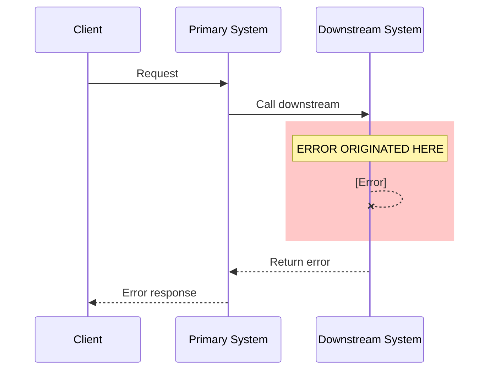

# Production Debug Express Rules

This file contains constraints, rules, quality standards, and workflow reference details for the production-debug-express skill. This is a **log-only** debugging skill — no codebase investigation is performed.

## Workflow Reference

### Phase 0: MCP Call Details

**MCP availability check**: Verify `antlog` and `yuntu` MCP servers are available. If missing, prompt user to install.

### Phase 1: MCP Call Details

**Time range extraction**:
```
CallMcpTool: server_name="antlog" tool_name="getTimeRangeOfTraceId" arguments={"traceId": "<traceId>"}
```

**Log queries (execute all in parallel)**:
```
CallMcpTool: server_name="antlog" tool_name="queryAppLogContent" arguments={
  "appName": "<appName>",
  "startTime": "<startTime>",
  "endTime": "<endTime>",
  "query": "'<traceId>'",
  "logPathKeyword": "error",
  "resultLimitPerLog": 100
}

CallMcpTool: server_name="antlog" tool_name="queryAppLogContent" arguments={
  "appName": "<appName>",
  "startTime": "<startTime>",
  "endTime": "<endTime>",
  "query": "'<traceId>'",
  "logPathKeyword": "biz",
  "resultLimitPerLog": 100
}

CallMcpTool: server_name="antlog" tool_name="queryAppLogContent" arguments={
  "appName": "<appName>",
  "startTime": "<startTime>",
  "endTime": "<endTime>",
  "query": "'<traceId>'",
  "logPathKeyword": "integration",
  "resultLimitPerLog": 100
}
```

**Trace tree query (execute in parallel with log queries)**:
```
CallMcpTool: server_name="yuntu" tool_name="queryYuntuTraceTree" arguments={"traceId": "<traceId>", "env": "main_online"}
```

### Phase 4: Yuque Upload Steps

**Step 11a. Resolve the Yuque book ID**:
```
CallMcpTool: server_name="yuque" tool_name="skylark_resolve_url" arguments={"url": "https://yuque.antfin.com/sean.lim/pgz2ru"}
```

**Step 11b. Read the debug report content**:
```
read_file: file_path="<skill_base_path>/output/<flow>/<error_type>/<payment_method>/<errorTime>_<traceId>_<appName>_debug_report.md"
```

**Step 11c. Create the document in Yuque**:
```
CallMcpTool: server_name="yuque" tool_name="skylark_doc_create" arguments={
  "book_id": <book_id from step 11a>,
  "title": "[<appName>] <flow> - <error_type> - <payment_method> - <errorTime>",
  "body": "<full markdown content of the debug report>",
  "format": "markdown",
  "public": "1"
}
```

## MCP Retry Policy

**Maximum Retries**: 3 attempts with 5-second delays between retries.

**When to Retry**:
- Network timeout errors
- Connection refused/reset errors
- Server temporarily unavailable (HTTP 503)
- Rate limit errors (HTTP 429)

**When NOT to Retry**:
- Authentication/authorization failures (401, 403)
- Invalid parameter errors (400)
- Resource not found errors (404)

**After 3 Failures**:
1. Try alternative MCP tool
2. Prompt user for manual data provision
3. Document limitation in Investigation Limitations section

## Required Parameters

### appName (Required)

The `appName` identifies the base system where the error was observed. **If not provided, ask the user before proceeding.**

**If appName is NOT provided**, use this prompt:

```
To debug this production issue, I need the appName (application name in antlog) where the error was observed.

Please provide:
- appName: The application name (e.g., iacquirefront, iexpprod, zfbunitradeproduct, etc.)
```

### traceId (Required)

The trace ID of the failing request. Used to correlate logs across systems.

**If traceId is NOT valid**, the `getTimeRangeOfTraceId` call will return no valid `startTime`/`endTime` (e.g., error, empty, or null response). In this case, **STOP IMMEDIATELY** and display:

```
⚠️ Invalid Trace ID

The provided traceId "<traceId>" is not valid. The time range lookup returned no valid result.

Possible reasons:
- The traceId does not exist or has expired
- The traceId format is incorrect (expected format: IP + timestamp + sequence, e.g., 0b40fd2317497100400283519e9729)
- The traceId was mistyped or copied incorrectly

Please verify the traceId and try again.
```

**DO NOT proceed with any log queries or further investigation if the traceId is invalid.**

### outputType (Optional)

The `outputType` parameter controls the token usage of the debugging workflow. **If not provided, default to `full`.**

| Value | Token Usage Optimization | Description |
|-------|-------------------------|-------------|
| `full` | None | Complete debug report with all sections. Report file is created and uploaded to Yuque. |
| `basic` | 1. Reduced output content<br>2. No file output<br>3. Skip Yuque upload | **No report file is created.** Only Issue Summary and Error Classification are output directly in the chat. No local file, no Yuque upload. |

**When outputType is `basic`**:
- No report file is created — output summary directly in chat
- No Yuque upload is performed
- The debugging workflow (Phases 0–3) is still executed in full — only the output is reduced
- Skip Step 10 (file creation) and Step 11 (Yuque upload) entirely

**When outputType is `full` (or not specified)**:
- The complete report template is used (all sections included)
- Report file is created at the standard output location
- Report is uploaded to Yuque (if yuque MCP is available)

## System-Specific Rules

### iopengw Gateway Boundary (STRICT)

`iopengw` is a **STRICT BOUNDARY** for debugging scope:

- **HARD STOP** - Do NOT trace beyond iopengw to any downstream systems
- **NO EXCEPTIONS** - Even if trace tree shows systems beyond iopengw, do NOT query their logs
- **ALL downstream info from iopengw logs ONLY**

**If iopengw is in trace tree:**
1. Query ONLY iopengw logs (using `message` and `digest` keywords)
2. Analyze the four message types:
   - `INBOUND_REQUEST` - What iopengw received from upstream
   - `OUTBOUND_REQUEST` - What iopengw sent to external channel
   - `OUTBOUND_RESPONSE` - What iopengw received from external channel
   - `INBOUND_RESPONSE` - What iopengw returned to upstream
3. Do NOT query systems beyond iopengw
4. See `references/iopengw-custom-rules.md` for details

### iuniversebase Modules

If appName is `inova`, `iorch`, or `itradecore`:
- Use `iuniversebase` as appName for antlog/yuntu queries
- See `references/iuniversebase-modules-rules.md` for details

## Log Query Rules

### Default Log Keywords

For standard systems:
- `biz` - Business service logs
- `integration` - Integration logs
- `error` - Error logs

### System-Specific Keywords

| System | Keywords |
|--------|----------|
| Standard systems | `biz`, `integration`, `error` |
| iopengw | `message`, `digest` |
| iuniversebase modules | Use `iuniversebase` as appName, standard keywords |

### Time Range

1. Extract time range using `getTimeRangeOfTraceId`
2. Add 5 minutes to `endTime` for log latency

### Log Parsing Template

When `queryAppLogContent` returns large single-line JSON output that cannot be read directly, use this standard approach to extract key fields:

**Step 1**: Write the raw output to a temporary file:
```
create_file: file_path="/tmp/antlog_<appName>_<logType>.txt" file_content="<raw_output>"
```

**Step 2**: Use `run_in_terminal` with `python3` to parse the JSON and extract key fields:
```bash
python3 -c "
import json
with open('/tmp/antlog_<appName>_<logType>.txt') as f:
    data = json.load(f)
for item in data:
    # Extract the actual log content field (varies by response format)
    content = item.get('Content', item.get('content', item.get('message', str(item))))
    # Extract timestamp if available
    ts = item.get('Timestamp', item.get('timestamp', item.get('__time__', '')))
    if ts:
        print(f'[{ts}] {content}')
    else:
        print(content)
"
```

**Step 3**: Read the parsed output or capture the terminal output for analysis.

**Adapt the python parsing script** based on the actual JSON structure returned by the antlog MCP. The key is to extract:
- **Timestamp**: When the log entry was created
- **Log level**: INFO, WARN, ERROR, etc.
- **Message content**: The actual log message
- **Exception stack traces**: Any exception details

## Adaptive Depth Rules

### Early Termination After Root Cause Found

Once the root cause is fully identified with complete log evidence, **STOP making additional queries**. This is the most important efficiency rule.

**After root cause is confirmed, you MUST NOT**:
- Query upstream system logs (e.g., iexpprod logs when the error is from a downstream channel) — the upstream system simply propagated the error
- Query additional downstream system logs beyond the error origin — you already have the evidence
- Run additional filtered antlog queries looking for the same error code in other systems — you already traced it
- Investigate systems that don't contribute to understanding the root cause

**Decision checkpoint after Phase 1B**: Before starting Phase 2, explicitly ask yourself:
1. Do I know which system caused the error? → If YES, continue to #2
2. Do I know WHY the error was thrown? → If YES, continue to #3
3. Do I have complete log evidence? → If YES, **skip directly to Phase 3 (Error Classification)**

## Error Tracing Rules

### Iterative Downstream Tracing

1. Analyze current system logs
2. Determine if error generated locally OR passed from downstream
3. If from downstream: Identify downstream `appName`, check iopengw boundary, continue tracing
4. Repeat until error origin found

**Decision Logic**:
```
Check downstream system logs
    ↓
Did it generate error locally?
    ↓ YES
Was error handled and flow continued?
    ↓ YES                    ↓ NO
Continue downstream       ERROR ORIGIN FOUND
```

### Distinguish Handled vs Unhandled Errors

**Handled Error (NOT root cause)** - Continue tracing:
- Error caught in try-catch AND flow continues
- Fallback logic executed successfully
- Whitelisted error codes that allow continuation

**Unhandled Error (IS root cause)** - Stop and investigate:
- Exception propagated up without handling
- Error caused method to return failure
- No fallback or recovery logic
- Re-thrown after logging

### Investigate WHY Downstream Threw Error

After identifying error origin system:
1. Query the system's logs for error details
2. Analyze log context to understand business logic that produces this error
3. Identify conditions that trigger this error from log patterns
4. Cross-reference error codes across upstream/downstream logs

## Error Classification Framework

### Classification Hierarchy

```
Error
├── Business Error (error due to merchant/request/external channel)
│   ├── One-time Error (transient, won't recur consistently)
│   │   └── Examples: ORDER_NOT_EXIST, BANK_CHANNEL_REJECT, INSUFFICIENT_BALANCE
│   └── Consistent Error (persistent until configuration fixed)
│       └── Examples: CONTRACT_NOT_FOUND, MERCHANT_NOT_ACTIVE, PARAM_ILLEGAL
└── System Error (error due to internal server issues)
    └── Examples: NullPointerException, TimeoutException, DatabaseConnectionException
```

### Classification Decision Tree

```
Is error caused by merchant/request/external channel?
    ↓ YES                                    ↓ NO
BUSINESS ERROR                          SYSTEM ERROR
    ↓
Will same error recur if merchant retries?
    ↓ YES                                    ↓ NO
CONSISTENT ERROR                        ONE-TIME ERROR
```

### Fix Responsibility

| Classification | Fix Responsibility |
|----------------|-------------------|
| One-time Business Error | Merchant |
| Consistent Business Error | Merchant/Ops |
| System Error | Development Team |

## Output File Rules

### Output Location

```
<skill_base_path>/output/<flow>/<error_type>/<payment_method>/<errorTime>_<traceId>_<appName>_debug_report.md
```

### Directory Levels

1. **Flow** (Level 1): Business flow or transaction type
2. **Error Type** (Level 2): Error code and description
3. **Payment Method** (Level 3): Payment method involved

### Filename Parameters

- **errorTime**: Timestamp when the error occurred (format: `YYYYMMDDHHmmss`). Extracted from the earliest error log entry found during Phase 1. If exact error time cannot be determined from logs, use the trace `startTime` returned by `getTimeRangeOfTraceId`.
- **traceId**: The trace ID of the failing request
- **appName**: The application name where the error was observed

### Default Values

- Flow → `GENERIC_FLOW`
- Error Type → `UNKNOWN_ERROR`
- Payment Method → `GENERIC`

### Yuque Upload

**Only performed when outputType is `full`**. When outputType is `basic`, skip Yuque upload entirely — no file was created.

After generating the local debug report, upload it to Yuque for sharing.

**Target Knowledge Base**: `https://yuque.antfin.com/sean.lim/pgz2ru`

**Upload Process**:

1. Resolve the book_id using `skylark_resolve_url` with the URL above
2. Read the local debug report file
3. Create a new document using `skylark_doc_create` with:
   - `book_id`: From step 1
   - `title`: `[<appName>] <flow> - <error_type> - <payment_method> - <errorTime>`
   - `body`: Full markdown content of the debug report
   - `format`: `"markdown"`
   - `public`: `"1"` (公开 — anyone with the link can view)

**Document Title Format**:

The title must follow this pattern for easy searching and browsing:
```
[<appName>] <flow> - <error_type> - <payment_method> - <errorTime>
```

**Example**: `[iexpprod] refund - PAYMENT_METHOD_LIST_IS_ILLEGAL - CARD - 20260421104937`

**Public Access**:

Always set `public` to `"1"` so that anyone with the link can view the report without needing Yuque login/permissions.

**Failure Handling**:

If the Yuque upload fails:
1. Retry up to 3 times (per MCP Retry Policy)
2. If still failing, document the failure in the Investigation Limitations section
3. The local file is still available and should be shared with the user directly

### Report Structure Template

#### Full Report Template (outputType: `full`)

```markdown
## Issue Summary

| Field | Value |
|---|---|
| Trace ID | [traceId] |
| Error Time | [YYYY-MM-DD HH:mm:ss] |
| Primary Application | [appName] |
| Downstream System(s) | [if applicable] |
| Symptom | [What went wrong] |
| Expected Behavior | [What should have happened] |
| Error Origin | [Which system caused the error] |

### Error Classification

| Field | Value |
|---|---|
| Type | [Business Logic / System Error - Expected Behavior] |
| Sub-type | [e.g., 3DS Authentication Required, Timeout, etc.] |
| Severity | [INFO / WARN / ERROR / CRITICAL] |
| Error Code | [error code] |
| Error Message | [error message] |
| System | [system where error originated] |
| Handled | [Yes/No - was error handled or did it cause unexpected failure] |

## Log Evidence

### Service Call Chain (from Yuntu Trace Tree)
[Trace tree showing service call sequence]

### Service Call Sequence Diagram


### Primary System Logs ([appName])
[Relevant log excerpts with timestamps]

### Downstream System Logs ([downstreamAppName])
[Relevant log excerpts from downstream system]

## Root Cause
[Clear explanation of why it fails, based on log evidence]

## Investigation Limitations
- [Log-only analysis — no codebase investigation was performed]
- [Document failed queries, inaccessible systems, etc.]
- [If deeper code-level investigation is needed, recommend using the full production-debug skill]
```

#### Basic Report Template (outputType: `basic`)

When `outputType` is `basic`, **no report file is created**. Only the Issue Summary and Error Classification are output directly in the chat — no local file, no Yuque upload. Use the following template for the chat output:

```markdown
## Issue Summary

| Field | Value |
|---|---|
| Trace ID | [traceId] |
| Error Time | [YYYY-MM-DD HH:mm:ss] |
| Primary Application | [appName] |
| Downstream System(s) | [if applicable] |
| Symptom | [What went wrong] |
| Expected Behavior | [What should have happened] |
| Error Origin | [Which system caused the error] |

### Error Classification

| Field | Value |
|---|---|
| Type | [Business Logic / System Error - Expected Behavior] |
| Sub-type | [e.g., 3DS Authentication Required, Timeout, etc.] |
| Severity | [INFO / WARN / ERROR / CRITICAL] |
| Error Code | [error code] |
| Error Message | [error message] |
| System | [system where error originated] |
| Handled | [Yes/No - was error handled or did it cause unexpected failure] |
```

## Quality Standards

Before completing, verify:

- [ ] **Specific cause identified**: Not just symptoms, but underlying reason
- [ ] **Correct system identified**: Error origin system correctly identified
- [ ] **Clear evidence**: Log evidence supports conclusion
- [ ] **WHY explained**: Understanding of why error occurs, not just where
- [ ] **Actionable recommendation**: Specific remediation steps provided
- [ ] **Output file created**: Debug report written to correct location
- [ ] **Classification correct**: Error properly classified
- [ ] **Investigation limitations documented**: All limitations documented (including log-only nature)

## MUST DO

- **Always treat each debugging task as completely independent** — no references to previous sessions
- **Always start with ZERO prior knowledge** — only use current trace's logs
- **Always investigate from first principles** — similar errors may have different causes
- Always ensure appName is provided before starting
- Always validate traceId by checking getTimeRangeOfTraceId result before proceeding
- Always retry MCP calls up to 3 times on failure
- Always extend endTime by 5 minutes for log latency
- Always query logs with correct keywords for the system
- Always query error, biz, AND integration logs in parallel (not sequentially)
- Always use yuntu to identify all systems in call chain
- Always trace errors iteratively through downstream systems
- Always check if downstream errors were handled
- Always investigate WHY the error origin system threw the error
- Always treat `iopengw` as STRICT BOUNDARY
- Always classify errors (Business vs System, One-time vs Consistent)
- Always create output markdown file when outputType is `full`
- When outputType is `basic`, skip file creation — output summary directly in chat
- Always upload debug report to Yuque when outputType is `full` and yuque MCP is available
- When outputType is `basic`, skip Yuque upload — no file was created
- Always set Yuque documents to public (`"1"`) so anyone with the link can view
- Always output ONLY Issue Summary + Error Classification (+ Yuque link for `full` mode) as the user-facing summary — keep the chat response brief
- Always document investigation limitations
- Always explain WHY, not just WHERE
- Always parallelize independent tool calls (log queries, downstream log queries)
- Always stop making additional MCP queries once the root cause is fully identified with complete log evidence — see §Early Termination After Root Cause Found
- Always use log parsing templates for large antlog output
- Always note that analysis is log-only in Investigation Limitations

## MUST NOT DO

- Reference previous debugging sessions or reports when starting a new task
- Carry over assumptions or conclusions from past investigations
- Assume similar errors have similar causes across different traces
- Start investigation without appName parameter
- Proceed with investigation when traceId is invalid (getTimeRangeOfTraceId returns no valid result)
- Search or read codebases during debugging — this is a log-only skill
- Skip creating the output markdown file when outputType is `basic`
- Skip uploading to Yuque when outputType is `basic`
- Include Log Evidence, Root Cause details, Fix Recommendation, or Investigation Limitations in the user-facing chat summary — these belong only in the full report on Yuque
- Stop at symptom description without root cause
- Skip time range extraction
- Stop at downstream system that handled error
- Stop at just identifying error source without investigating WHY
- Trace beyond iopengw to ANY downstream systems
- Query logs for systems beyond iopengw
- Assume error originated in primary system without checking
- Ignore downstream systems in trace tree
- Assume all ERROR level logs indicate real failures
- Propose fixes without log evidence
- Read MCP tool JSON schemas at runtime (parameters are documented in the skill)
- Query error/biz/integration logs sequentially — always parallelize them
- Continue querying upstream or additional downstream system logs after the root cause is fully identified — see §Early Termination After Root Cause Found
- Use `search_codebase`, `grep_code`, `search_file`, `lsp`, or any code investigation tool — this is a log-only skill
